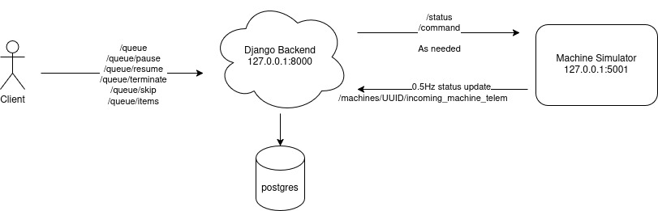

# Queue Mowing Jobs Project

## Project

This project is a simple queuing system for scheduling fields for a machine in the field to process.

### Task

Design a system and API endpoints for the new feature that allows a user to queue fields for a single machine.

### Requirements

1. Queuing system must be able to handle user:

* Add a field to empty queue
* Add a field at a specific position OR end of populated queue (ex: user forgot to queue field E, but now remembered)
* Stopping/resuming of queue (ex: pause machine to refill fuel, then resume)
* Terminating queue (ex: incoming rain, can't mow rest of day)
* Continue from previously terminated queue (ex: next day rain dried, continue mowing)
* Skipping queued field (ex: field C  queued but busy harvesting, continue with field D)
* Removing one or more fields from queue (ex: user queued too much and wants to reduce queue)

2. Keep historical data of queue. Example: User wants to know all fields mowed on Monday, and if not why, how far the machine got through the queue?
3. Queue can be modified when the machine is in operation
4. Before machine is dispatched to first item of queue, user must "start" queue
5. Machine can progress the queue when current task is completed once the user starts the queue

#### Edge cases

* Same field can appear in queue more than once and consecutively
* Field inserted at position 10, but only 4 items in queue will be an invalid request (HTTP Code 422)
* If field is marked `skipped` that machine is currently mowing, machine will immediately move to next task

### Assumptions

* No more than 10 machines at a time
* Only single user using system
* Max queue size is 100 fields
* Each machine has its own queue it is responsible for, no multi worker or sharing of queues
* Backend Django server and Postgres RDBMS required, additional systems available
* Backend to Machine communication is already implemented based on messages, but state of machine can be modified
* Machine Simulator automatically responds to commands from backend (start, stop, pause, resume)
* Machine Simulator publishes status updates to backend every 2 seconds (state, timestamp, current_field)
* Machine Simulator currently has several states, but can be amended or modified
  * Idle
  * Mowing
  * Paused

### Additional Information

* Authentication and authorization is outside scope
* Machine transit between fields already in place, out of scope of this system
* Long term archival of data, cold storage, is outside scope
* Full test suite (E2E, integration, unit) outside of scope
* Will be testing the endpoint(s) with curl/httpie to inspect responses based on API provided documents
* Feel free to use other local services via docker such as a database, or key val store
* If the deliverables don't work on tester's computer we'll be screen sharing/evaluating the deliverables on your computer
* **STOP AT MAX 4 HOURS**, what isn't done we can discuss and go from there. No penalty for stopping at 4 hr as this project scope may be too big for 4 hours.

## Boilerplate Code

Provided is a bare bones Django setup and in field Machine Simulator. These have been provided to help jump start the project and are not a definite representation of required API endpoints or part of code. Feel free to modify, change, or discard anything as desired.

## Overview


* Django backend serve APIs for the client and the machine
* Machine Simulator is provided that will retain state and publish at 0.5Hz to backend
* Client APIs are available for a client to interact with the queue

### Deliverables

* Working Django implementation to serve as Proof of Concept
* Brief docs on how to run deliverables for evaluation

### Evaluation Criteria

* Code organization and clarity
* API design decisions
* Data model appropriateness
* Handling of edge cases

### Nice To Have

* Django fixture to seed database data
* Project packaged up as a simple to use Docker compose file
* Brief plan on how to scale to higher number of machines
* Brief plan on how to lock a queue for no multi user conflicts or support multiple users editing same queue

## Project Layout

### DB

```bash
# start DB
docker run -p 5432:5432  -e POSTGRES_USER=dbuser -e POSTGRES_PASSWORD=Begin123 -e POSTGRES_DB=portal -d postgres:16.8

# run migrations
python3 manage.py migrate 
```

### Web Service

```bash
# install django, use virtualenv if desired
pip install -r build/requirements.txt

# start webserver
cd backend
python manage.py runserver
```

### Machine Simulator

```bash
# no third party libs needed
cd scripts
python3 machine_sim.py
```
